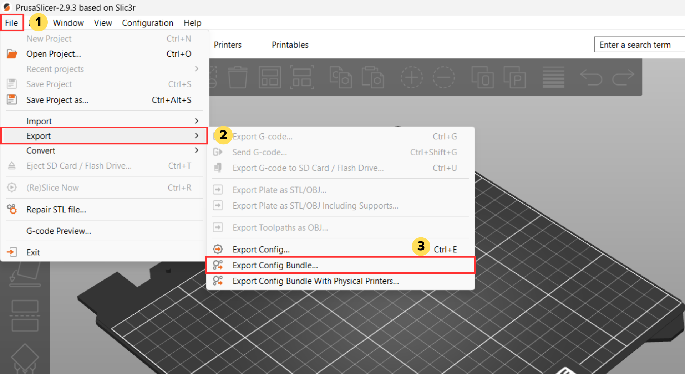
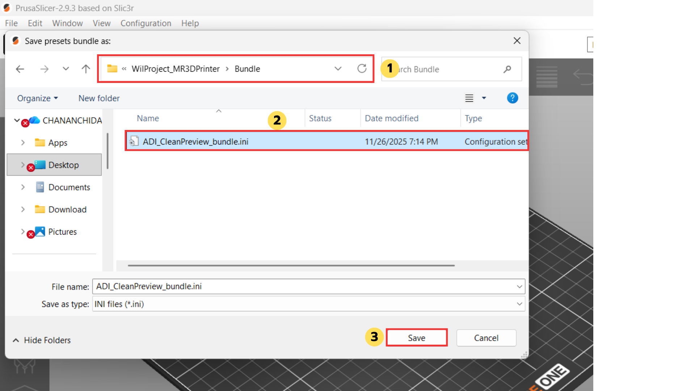

# 3D Printing Management and Monitoring Platform with Web Interface and Mixed Reality

ระบบนี้คือ **Web Console สำหรับควบคุมและมอนิเตอร์เครื่องพิมพ์ 3D** ประกอบด้วย:

- **Backend**: FastAPI + SQLite + MinIO/S3 + OctoPrint + PrusaSlicer CLI  
- **Frontend**: React SPA  
- **Storage กลาง**: MinIO (S3-compatible) สำหรับเก็บ STL/G-code + preview + manifest  

**ฟีเจอร์หลัก**

- Multi-user print queue
- Custom storage / catalog
- Print history & reprint
- Real-time monitor (status, webcam, temps, progress)
- Notifications (Web UI + Email + Teams* ถ้าตั้งค่า)
- Latency logging สำหรับงานทดลองวิจัย/ประเมินระบบ

---

# สิ่งที่ต้องติดตั้งก่อนใช้งาน

**ซอฟต์แวร์ที่ต้องติดตั้งก่อนใช้งานโปรเจกต์นี้**

| โปรแกรม                  | ใช้ทำอะไร                                             | ลิงก์ดาวน์โหลด |
|--------------------------|--------------------------------------------------------|-----------------|
| **Python 3.10+**         | รัน Backend (FastAPI, สคริปต์ต่าง ๆ)                 | https://www.python.org/downloads/ |
| **Node.js (LTS)**        | รัน Frontend (React, webpack dev server)              | https://nodejs.org/en/download |
| **PrusaSlicer**          | ใช้ CLI slice STL → G-code และใช้ preset ต่าง ๆ      | https://www.prusa3d.com/page/prusaslicer_424/ |
| **MinIO Server**         | ทำหน้าที่เป็น S3-compatible storage สำหรับไฟล์พิมพ์   | https://min.io/download |
| **OctoPrint**            | คุมเครื่องพิมพ์ 3D จริง (upload / start / pause ฯลฯ) | https://octoprint.org/download/ |
| **DB Browser for SQLite**| ใช้เปิด/ดู/แก้ `users.db`                            | https://sqlitebrowser.org/dl/ |

---

## 1. ภาพรวมระบบ (Overview)

ระบบนี้คือ **Web Console สำหรับควบคุมและมอนิเตอร์เครื่องพิมพ์ 3D** ที่ใช้ในองค์กร มีองค์ประกอบใหญ่ ๆ 4 ส่วน:

1. **Backend (FastAPI + SQLite + MinIO + OctoPrint + PrusaSlicer)**
   - REST API / WebSocket / SSE
   - จัดการผู้ใช้, คิวพิมพ์, ประวัติ, storage, notification, latency log

2. **Frontend (React SPA)**
   - เว็บ UI ให้ผู้ใช้:
     - อัปโหลดไฟล์ STL/G-code
     - สั่งพิมพ์ / ดูคิว / มอนิเตอร์
     - ดู custom storage / reprint / ลบไฟล์

3. **Storage (MinIO – S3 compatible)**
   - เก็บไฟล์:
     - `staging/` (ไฟล์ที่เพิ่งอัปโหลด)
     - `catalog/` (ไฟล์ที่ finalize แล้ว: G-code + preview + manifest)

4. **เครื่องพิมพ์ + OctoPrint + PrusaSlicer**
   - **OctoPrint** → รับคำสั่งพิมพ์จริง (upload/select/start/pause/cancel)
   - **PrusaSlicer CLI** → slice STL เป็น G-code + gen preview / manifest

---

## 2. Features

- Authentication ด้วย Employee Number (รองรับ auto-confirm / first-login confirmation)
- **Multi-user Print Queue**
  - มองเห็นคิวรวมของเครื่อง
  - Reorder คิว (ตามสิทธิ์)
  - Cancel / Pause / Resume jobs
- **Custom Storage (Catalog)**
  - เก็บ G-code พร้อม preview + manifest
  - Reprint จาก storage
  - Hard delete triple (gcode + preview + manifest)
- **Print History**
  - ผูกกับผู้ใช้
  - รองรับ reprint
- **Real-time Monitor**
  - เครื่องอยู่สถานะอะไร (Ready / Printing / Paused / Error)
  - progress, ETA, temps, webcam preview
- **Notifications**
  - แสดงใน UI
  - optional Email / Teams DM (ผ่าน Power Automate Flow)
- **Latency Logging**
  - บันทึก latency ของการควบคุม/มอนิเตอร์ เพื่อใช้ในการทดลอง/ประเมินระบบ

---

## 3. Repository Structure

```text
MR3DPrinter/
├─ Backend/                # FastAPI backend
│   ├─ main.py             # FastAPI application entrypoint
│   ├─ auth.py, auth_routes.py
│   ├─ db.py, models.py, schemas.py
│   ├─ files_api.py, files_raw.py
│   ├─ s3util.py, custom_storage_s3.py
│   ├─ print_api.py, print_queue.py, print_history.py
│   ├─ notifications.py, emailer.py, teams_flow_webhook.py
│   ├─ latency.py, latency_api.py
│   ├─ preview_gcode_image.py, slicer_core.py, slicer_prusa.py
│   ├─ create_bucket.py
│   ├─ cleanup_jobs.py, cleanup_notifications.py, cleanup_storage_ghosts.py
│   ├─ requirements.txt
│   ├─ .env                # backend configuration
│   └─ users.db            # SQLite database
│
├─ Frontend/               # React SPA
│   ├─ package.json
│   ├─ src/
│   │   ├─ App.js, App.css
│   │   ├─ api/
│   │   ├─ auth/
│   │   ├─ pages/
│   │   ├─ components/
│   │   └─ setupProxy.js, index.js, index.css
│   └─ .env                # frontend configuration
│
└─ README.md

```

---

## 4. Backend Architecture

### 4.1 Core Components

- main.py

    - สร้าง FastAPI app และ mount routers จากโมดูลอื่น

    - ตั้งค่า CORS, middleware, exception handlers

- db.py / models.py / schemas.py

    - db.py

        - สร้าง engine สำหรับ SQLite (users.db)

        - นิยาม SessionLocal และ Base

- models.py

    - ORM models สำหรับ entity หลัก เช่น User, PrintJob, StorageFile, Notification, LatencyLog

- schemas.py

    - Pydantic models สำหรับ request/response ในแต่ละ API

- Authentication (auth.py, auth_routes.py)

    - JWT-based auth (access / refresh)

    - Dependency:

        - get_current_user

        - get_confirmed_user

        - get_manager_user

    - Routes:

        - POST /auth/login

        - POST /auth/refresh

        - GET /auth/me

        - POST /auth/logout

### 4.2 File Storage & Custom Storage

- s3util.py

    - wrapper สำหรับติดต่อ MinIO/S3 (HEAD, GET, PUT, stream, range)

- files_raw.py

    - raw file serving:

        - /files/raw

        - /files/download

        - /files/head

        - /files/exists

- custom_storage_s3.py

    - custom storage logic:

        - upload ผ่าน presigned URL ไป staging

        - finalize → slice STL → G-code → generate preview → update catalog

        - list catalog

        - hard delete triple (รวมลบ metadata ใน DB)

### 4.3 Print Queue & OctoPrint Integration

- print_queue.py

    - จัดการ queue state ใน DB

    - ตอบ endpoint เช่น:

        - GET /printers/{id}/queue

        - PATCH /printers/{id}/queue/reorder

        - POST /printers/{id}/queue/enqueue

    - เชื่อมกับ OctoPrint:

        - upload/select job

        - start/pause/resume/cancel

        - polling job status (fallback)

    - print_api.py

        - รวบรวม API ที่ frontend ใช้ในการดึง queue/current job และสั่งการเครื่อง

    - print_history.py

        - API สำหรับประวัติการพิมพ์ต่อ user

### 4.4 Notifications & Latency

- notifications.py

    - สร้าง notification record ใน DB

    - broadcast ให้ frontend ผ่าน SSE/WebSocket

- emailer.py, teams_flow_webhook.py

    - ส่ง email ผ่าน SMTP

    - ส่ง event ไป Power Automate / Teams ตาม config

- latency.py, latency_api.py

    - รับ log latency จาก frontend (POST /latency/log)

    - เก็บลง DB เพื่อใช้วิเคราะห์ performance

### 4.5 Slicing & Preview

- slicer_core.py / slicer_prusa.py

    - ทำงานกับ PrusaSlicer CLI ผ่าน path ที่กำหนดใน .env

    - รับ STL → slice เป็น G-code ด้วย preset ที่กำหนด

    - extract metadata (estimated time, filament usage ฯลฯ)

- preview_gcode_image.py

    - render preview image จาก G-code (ใช้ตอน finalize หรือ regenerate preview)

---

## 5. Frontend Architecture
### 5.1 Core Structure

- src/index.js / src/index.css

    - entrypoint ของ React app

    - mount <App /> และจัดการ global styles

- src/App.js

    - layout หลัก + routing

    - เลือกหน้าแสดงตาม state การ login (login page / main app)

### 5.2 Authentication Layer

- src/auth/AuthContext.js

    - เก็บและจัดการ access token / refresh token ใน localStorage

    - login, logout, auto refresh token ตามเวลาหมดอายุ

    - เปิด WebSocket เพื่อรับ event จาก backend (เช่น force logout)

### 5.3 API Layer

- src/api/base.js, src/api/index.js, src/api/useApi.js

    - ส่วนกลางสำหรับเรียก backend API (ผ่าน fetch)

    - จัดการใส่ Authorization header จาก token

    - รวมฟังก์ชันสำหรับ:

        - queue

        - storage

        - print control

        - notifications

        - latency logging ฯลฯ

### 5.4 Pages & Components

- pages/MonitorPage.js

    - แสดงสถานะ real-time (ผ่าน SSE + polling)

    - graph/progress/temps + video stream

    - ปุ่มควบคุม nozzle/bed temp, speed (ขึ้นกับสิทธิ์และสถานะ job)

- pages/PrintingPage.js

    - แสดง queue งานทั้งหมด

    - drag & drop reorder (เฉพาะ job ที่อนุญาต)

    - cancel job ที่เป็นของ user เอง (ตาม rule)

    - trigger upload/new job ผ่าน modal

- pages/StoragePage.js

    - แสดง G-code ใน catalog

    - Filter ตาม model / search ตามชื่อ

    - reprint / delete (ตามสิทธิ์)

- Components สำคัญอื่น ๆ:

    - ModalUpload, PreviewPrintModal, StorageReprintModal

    - GcodeWebGLPreview

    - Navbar, NotificationBell, Login

    - VideoStream, RightPanel, PrintControls, PrintJobInfo, PrintProgress
---

## 6. Environment & Dependencies

### 6.1 Backend

**ภาษา/Framework**

- Python 3.10+

- FastAPI

- SQLAlchemy

- Pydantic

**External**

- SQLite (ไฟล์ users.db)

- MinIO / S3-compatible storage

- OctoPrint instance

- PrusaSlicer (console/CLI)

**การติดตั้งพื้นฐาน**

```bash
cd Backend
# ลบ venv เดิม (ถ้ามี)
Remove-Item -Recurse -Force .venv 2>$null

# virtual environment
python -m venv .venv
# หรือ py -3 -m venv .venv

# activate
.\.venv\Scripts\Activate.ps1        # PowerShell
# .\.venv\Scripts\activate.bat      # cmd
# source .venv/bin/activate         # macOS / Linux

# dependencies
pip install --upgrade pip
pip install -r requirements.txt

# ถ้ามีปัญหา ให้ติดตั้งแพ็กเกจหลักซ้ำ
python -m pip install "uvicorn[standard]" fastapi SQLAlchemy python-dotenv

# เพิ่มไลบรารี geometry ถ้าขาด
pip install --upgrade trimesh shapely numpy

```

**ก่อนใช้งาน backend ทุกครั้งควร activate .venv ให้เรียบร้อย**

### 6.2 Frontend

**ภาษา/Framework**

- Node.js (LTS)

- React

- Webpack / CRA tooling (ตามที่ระบุใน package.json)

**การติดตั้งพื้นฐาน**
```bash
cd Frontend

npm install
# หรือ yarn install

```
---

## 7. Configuration

### 7.1 Backend .env

ไฟล์ Backend/.env ใช้กำหนดค่า runtime ของระบบ backend ทั้งหมด ค่าตัวอย่าง (ต้องปรับตาม environment จริง)

```text
# --- Security / Auth ---
SECRET_KEY=change_this_to_real_secret
JWT_ALGORITHM=HS256
ACCESS_TOKEN_EXPIRE_SECONDS=28800
REFRESH_SECRET_KEY=change_this_too
REFRESH_TOKEN_EXPIRE_SECONDS=604800
JWT_CLOCK_SKEW_SECONDS=60

# --- URLs ---
FRONTEND_BASE_URL=http://localhost:3000
PUBLIC_BASE_URL=http://localhost:8000
MAIN_BACKEND=http://127.0.0.1:8000
BACKEND_INTERNAL_BASE=http://127.0.0.1:8000

DEFAULT_PRINTER_ID=prusa-core-one

# --- Database ---
DB_PATH=./users.db
DATABASE_URL=sqlite:///./users.db

# --- CORS ---
CORS_ORIGINS=http://localhost:3000,http://127.0.0.1:3000

# --- S3 / MinIO ---
STORAGE_BACKEND=s3
S3_ENDPOINT=http://localhost:9000
S3_BUCKET=printer-store
S3_REGION=us-east-1
S3_ACCESS_KEY=admin
S3_SECRET_KEY=admin123
S3_FORCE_PATH_STYLE=true
S3_SECURE=false

# --- OctoPrint ---
OCTOPRINT_BASE=http://<octoprint-host-or-ip>:5000
OCTOPRINT_API_KEY=<your_octoprint_api_key>

# --- PrusaSlicer ---
PRUSA_SLICER_BIN=C:\Program Files\Prusa3D\PrusaSlicer\prusa-slicer-console.exe
PRUSA_DATADIR=C:\Users\<user>\AppData\Roaming\PrusaSlicer
PRUSA_BUNDLE_PATH=D:\Projects\WilProject_MR3DPrinter\Bundle\ADI_CleanPreview_bundle.ini

PRUSA_PRINTER_PRESET=Prusa CORE One HF0.4 nozzle
PRUSA_PRINT_PRESET=0.20mm SPEED @COREONE HF0.4
PRUSA_ALLOW_FE_PRESET=1
PRUSA_STRICT_PRESET=1

```
**จุดที่ต้องปรับตามเครื่องใหม่เสมอ**

- **PRUSA_DATADIR**
  - path ของ config directory ของ PrusaSlicer ของเครื่องคอมนั้น ๆ
  - **วิธีหา path ของ `PRUSA_DATADIR`**
    1. เข้า Program PrusaSlicer  
    2. ไปที่เมนู **Help → Show Configuration Folder** ตามรูปด้านล่าง


    3. ไปตรง path ด้านบนแล้ว copy path มาใส่ใน `PRUSA_DATADIR` ใน `Backend/.env`


- **PRUSA_BUNDLE_PATH**
  - path ของไฟล์ bundle `.ini` เช่น `ADI_CleanPreview_bundle.ini`
  - บนเครื่องใหม่ path นี้จะเปลี่ยนตามที่จัดเก็บโปรเจกต์/ไฟล์จริง

  **หมายเหตุ (กรณีย้ายเครื่องใหม่)**  
  ต้อง Export Config Bundle ใหม่จากเครื่องใหม่ก่อน แล้วค่อยเอา path มาใส่ใน `.env`:

  1. เข้า Program PrusaSlicer  
  2. ไปที่เมนู **File → Export Config Bundle...** ตามรูปด้านล่าง



  3. เลือกโฟลเดอร์ `Bundle` ที่เก็บไฟล์ `.ini` ของโปรเจกต์ ตามรูปด้านล่าง



  4. หลังจาก Save แล้ว ให้ไปที่โฟลเดอร์ `Bundle` นั้นของโปรเจคแล้ว copy path แบบเต็ม แล้วนำไปใส่ใน `PRUSA_BUNDLE_PATH` ใน `Backend/.env`

---

## 8. Running Locally

ลำดับการรันระบบในเครื่องพัฒนา

**1.Start MinIO**

```bash
$env:MINIO_ROOT_USER="admin"
$env:MINIO_ROOT_PASSWORD="admin123"

& "C:\minio\minio.exe" server "C:\minio\data" --address ":9000" --console-address ":9001"
```

สร้าง bucket ตามชื่อใน S3_BUCKET (เช่น printer-store) ด้วย UI หรือ create_bucket.py

**2.ตรวจว่า OctoPrint ออนไลน์**

    - เปิด http://<octoprint-host>:5000

    - ตรวจสอบว่า API key ถูกต้องและสามารถเข้าถึงได้จากเครื่อง backend

**3.Start Backend**

```bash
    cd Backend
    .\.venv\Scripts\Activate.ps1
    uvicorn main:app --reload --env-file .env
    uvicorn main:app --reload --host 0.0.0.0 --port 8000
```

**4.Start Frontend**

```bash
cd Frontend
npm start
```

**5.เปิด browser**

เปิด ไปที่ http://localhost:3000 แล้วทดลอง login / upload / queue / monitor

---

## 9. Data & Maintenance

### 9.1 Database

    - ใช้ SQLite ในไฟล์ Backend/users.db

    - สามารถสำรอง/ย้ายได้โดย copy ไฟล์นี้ไปเครื่องใหม่

### 9.2 Maintenance Scripts

ใน Backend:

- ล้าง print jobs ที่เก่าเกินกำหนด:

```bash
python .\scripts\cleanup_jobs.py
```

- ล้าง notifications เก่า:

```bash
python .\scripts\cleanup_notifications.py
```

- ตรวจและลบ ghost records (Storage/Queue):

```bash
python .\scripts\cleanup_storage_ghosts.py         # dry-run
python .\scripts\cleanup_storage_ghosts.py --apply # apply deletion
```
---

# 10.cleanup_db.bat + Task Scheduler (ลบข้อมูลอัตโนมัติบน Windows)

ไฟล์ cleanup_db.bat ใช้รันงานทำความสะอาดฐานข้อมูลอัตโนมัติบน Windows:

- เปิด virtualenv ของ Backend

- รันสคริปต์ Python สำหรับลบข้อมูลเก่า (notifications, jobs)

- สามารถตั้งเวลาให้ Windows เรียก .bat นี้ทุกวันด้วย Task Scheduler

### 10.1 ตัวอย่างเนื้อหา cleanup_db.bat

วางไฟล์นี้ในโฟลเดอร์ Backend

```bat
@echo off
REM เปลี่ยนมาที่โฟลเดอร์ Backend (โฟลเดอร์เดียวกับไฟล์นี้)
cd /d "%~dp0"

REM เปิด virtualenv (ต้องมี .venv อยู่แล้ว)
call .venv\Scripts\activate.bat

REM ลบ notifications เก่ากว่า KEEP_DAYS (ดูค่าใน cleanup_notifications.py)
python scripts\cleanup_notifications.py

REM ถ้าต้องการลบ print_jobs เก่ามากด้วย ให้เปิดบรรทัดนี้
REM python scripts\cleanup_jobs.py

echo Done.
```
ทดสอบ

```bash
cd Backend
.\cleanup_db.bat
```

### 10.2 ตั้งให้รันอัตโนมัติด้วย Windows Task Scheduler

    1.เปิด Task Scheduler (พิมพ์ใน Start Menu)

    2.เลือก Create Basic Task...

    3.ตั้งชื่อ เช่น MR3DPrinter Cleanup DB

    4.Trigger: เลือก Daily ตั้งเวลาประมาณ 03:00

    5.Action: เลือก Start a program

    6.ตั้งค่า:

- Program/script:
```bash
cmd.exe
```

- Add arguments (optional):
```bash
/c "C:\Path\To\(Folder name)\Backend\cleanup_db.bat"
```

- Start in (optional):
```bash
C:\Path\To\(Folder name)\Backend
```

7.กด Finish แล้วลองคลิกขวา task → Run เพื่อลองทดสอบ ถ้าไม่มี error และสคริปต์ cleanup ทำงานตามที่คาดไว้ แปลว่าระบบล้างข้อมูลอัตโนมัติถูกตั้งค่าเรียบร้อยแล้ว

---

## 11. Known Issues & Troubleshooting

รวบรวมปัญหาที่เคยเจอ/มีโอกาสเจอบ่อย ๆ ตอนย้ายเครื่องหรือรันระบบ และแนวทางเช็ค/แก้ไข


### 11.1 Backend ไม่ยอมรัน / หา `uvicorn` ไม่เจอ

**อาการ**

- พิมพ์ `uvicorn main:app ...` แล้วขึ้น  
  `uvicorn : The term 'uvicorn' is not recognized ...`
- หรือรัน `pip install -r requirements.txt` แล้วมันไปเรียก Python ของ path แปลก ๆ (เครื่องเก่า / user อื่น)

**สาเหตุที่เป็นไปได้**

- ยังไม่ได้ activate `.venv` ของโฟลเดอร์ `Backend`
- `.venv` ถูก copy มาจากเครื่องอื่น → path ภายในพัง
- ไม่ได้ติดตั้ง `uvicorn[standard]` ใน venv ปัจจุบัน

**วิธีแก้**

1. ลบ venv เดิมทิ้ง แล้วสร้างใหม่เสมอเมื่อย้ายเครื่อง

   ```powershell
   cd Backend
   Remove-Item -Recurse -Force .venv 2>$null
   py -3.10 -m venv .venv
   .\.venv\Scripts\Activate.ps1
    ```

2.ติดตั้ง dependencies ใหม่

 ```powershell
 python -m pip install -U pip
pip install -r requirements.txt
# ถ้ายัง error ให้ลงซ้ำ
python -m pip install "uvicorn[standard]" fastapi SQLAlchemy python-dotenv
```

3.รัน backend อีกครั้ง
 ```powershell
uvicorn main:app --reload --env-file .env
```

### 11.2 Slice ไม่ผ่าน / Finalize STL แล้ว backend ตอบ 500

**อาการ**

- กด finalize STL จากหน้าเว็บแล้วขึ้น error 500

- ใน log เห็นข้อความประมาณว่า “cannot find prusa-slicer-console.exe” หรือ bundle not found

**สาเหตุที่เป็นไปได้**

- PRUSA_SLICER_BIN ใน .env ชี้ไป path ที่ไม่มีอยู่จริง

- PRUSA_DATADIR ไม่ตรงกับ config folder ของ PrusaSlicer บนเครื่องนั้น

- PRUSA_BUNDLE_PATH ไม่ตรงกับตำแหน่งไฟล์ bundle .ini ของโปรเจกต์

**วิธีแก้**

1.เปิด PrusaSlicer → ไปที่ Help → Show Configuration Folder เอา path จากแถบ address bar มาใส่ใน PRUSA_DATADIR

2.Export bundle ใหม่:

- File → Export Config Bundle...

- เซฟเป็นไฟล์ .ini ไว้ในโฟลเดอร์ Bundle ของโปรเจกต์

- copy path เต็มมาใส่ใน PRUSA_BUNDLE_PATH

3.ตรวจ path ไปที่ prusa-slicer-console.exe ว่าถูกต้อง เช่น

 ```text
PRUSA_SLICER_BIN=C:\Program Files\Prusa3D\PrusaSlicer\prusa-slicer-console.exe
```

4.restart backend แล้วลอง finalize STL ใหม่

### 11.3 MinIO ใช้งานไม่ได้ (Connection refused / NoSuchBucket / AccessDenied)

**อาการ**

- log ขึ้นว่า ConnectionError ไปที่ http://localhost:9000

- หรือขึ้น NoSuchBucket / AccessDenied ตอนอัปโหลด/ดาวน์โหลดไฟล์

- เว็บขึ้น error เกี่ยวกับ storage

**สาเหตุที่เป็นไปได้**

- MinIO ยังไม่รัน

- ยังไม่ได้สร้าง bucket ตามชื่อใน S3_BUCKET

- ค่า S3_ENDPOINT, S3_ACCESS_KEY, S3_SECRET_KEY ใน .env ไม่ตรงกับ MinIO

**วิธีแก้**

1.รัน MinIO ให้เรียบร้อย 

 ```bash
$env:MINIO_ROOT_USER="admin"
$env:MINIO_ROOT_PASSWORD="admin123"
& "C:\minio\minio.exe" server "C:\minio\data" --address ":9000" --console-address ":9001"
```

2.เปิด http://localhost:9001 → login → สร้าง bucket ชื่อเดียวกับ S3_BUCKET (เช่น printer-store)

3.ตรวจ .env ให้ค่าตรงกับที่ใช้งานจริง:

 ```text
S3_ENDPOINT=http://localhost:9000
S3_BUCKET=printer-store
S3_ACCESS_KEY=admin
S3_SECRET_KEY=admin123
S3_FORCE_PATH_STYLE=true
S3_SECURE=false
 ```

4.restart backend แล้วลองอัปโหลด/ดาวน์โหลดอีกครั้ง

### 11.4 Preview / Thumbnail ไม่แสดงในหน้าเว็บ

**อาการ**

- ใน Storage หรือ Queue ไม่มีรูป preview แสดง

- หรือใน Teams DM / Notification ขึ้น No preview ทั้ง ๆ ที่คิดว่าน่าจะมี

**สาเหตุที่เป็นไปได้**

- ตอน finalize ยังไม่สร้างไฟล์ .preview.png (หรือขนาดไฟล์เล็กเกิน)

- Thumb URL ที่ backend ส่งไปไม่ใช่ URL แท้ (ยังเป็นแค่ path ใน S3)

- มี CORS ปิดกั้นเวลาหน้าบ้านดึงรูปจาก MinIO

**วิธีเช็คและแก้**

1.เปิด MinIO console → เข้า bucket → ตรวจว่า folder ใน catalog/... มีไฟล์มั้ย

- Filename.gcode

- Filename.preview.png

- Filename.json

2.ถ้าไม่มี .preview.png ให้ลอง:

- regenerate preview (ถ้ามีปุ่มในเว็บ)

- หรือ finalize STL อีกครั้ง

3.ตรวจ log backend ว่ามี error จาก preview_gcode_image.py หรือไม่

4.ถ้า preview มีใน MinIO แต่หน้าเว็บไม่โชว์:

- เปิด dev tools (F12) → tab Network → ดู request รูปว่าขึ้น 404/403 หรือไม่

- ถ้า 403 CORS ให้ตั้ง CORS ของ MinIO ให้ allow จาก origin ของ frontend

# Raspberry Pi Setup (Detection System)
If you reused the same Raspberry Pi board, most setup steps are already completed.

The Raspberry Pi performs:
- Camera capture
- YOLO ONNX detection
- Bed empty classification
- Sending alerts to the backend

## 1. Update IP inside detect-stream.service
Some deployments include IPs hardcoded inside the service (SELF_BASE or BACKEND_URL fallback).

Check the service file:
```bash
sudo nano /etc/systemd/system/detect-stream.service
```
Look for lines like:
```ini
Environment=BACKEND_URL=http://10.228.0.118:8000/notifications/alerts
Environment=SNAPSHOT_URL=http://10.228.0.239:8080/?action=snapshot
Environment=SELF_BASE=http://10.228.0.239:8000
```
If they exist → update all to new IPs.
Example (after update):
```ini
Environment=BACKEND_URL=http://<NEW_BACKEND_IP>:8000/notifications/alerts
Environment=SNAPSHOT_URL=http://<PI_IP>:8080/?action=snapshot
Environment=SELF_BASE=http://<PI_IP>:8000
```
Then reload service:
```bash
sudo systemctl daemon-reload
sudo systemctl restart detect-stream
```
## 2. Troubleshooting – Raspberry Pi (Detection + Camera + OctoPrint)
### 2.1 Detection Service Not Running
**Symptoms:** No alerts sent to backend, no logs, service stops  
**Fix:**
- Restart the service:
  ```bash
  sudo systemctl restart detect-stream
  ```
- View logs:
  ```bash
  journalctl -u detect-stream -f
  ```
- Check for missing model paths or wrong IP inside:

    `/home/adi/detect_stream.env`

    `/etc/systemd/system/detect-stream.service`

### 2.2 Wrong IP After Changing Network
**Symptoms:** No alerts, backend gets nothing, camera not loading
**Fix:**

- Update Pi IP in:

    - SNAPSHOT_URL (inside detect_stream.env)

    - Any hardcoded IP inside detect-stream.service

- Reload service:
  ```bash
  sudo systemctl daemon-reload
  sudo systemctl restart detect-stream
  ```
### 2.3 Camera Feed Not Working
**Symptoms:** Black image, snapshot not updating
**Fix:**
- Test snapshot URL:
  ```cpp
  http://<PI_IP>:8080/?action=snapshot
  ```
- Check camera device:
  ```bash
  ls /dev/video*
  ```
Device may switch `/dev/video0 → /dev/video1`

- Restart or replug USB camera if needed

### 2.4 Cannot Reach Backend
**Symptoms:** “Failed to send alert” in logs
**Fix:**
- Test connectivity:
  ```bash
  ping <BACKEND_IP>
  curl http://<BACKEND_IP>:8000/healthz/live
  ```
- Ensure Pi and backend are on the same network
- Check firewall or Wi-Fi isolation settings

### 2.5 Detection Not Triggering
**Symptoms:** No spaghetti/layer-shift detection
**Fix:**
- Confirm ONNX models exist in:

    `/home/adi/models/print_issue/`

    `/home/adi/models/bed_empty/`

- Lower confidence temporarily:
  ```ini
  CONF_THRESHOLD=0.5
  ```
- Ensure camera provides clear, bright images

### 2.6 OctoPrint Not Responding
**Symptoms:** Backend queue stuck, printer not starting
**Fix:**
- Restart OctoPrint:
  ```bash
  sudo systemctl restart octoprint
  ```
- Verify printer USB cable

- Check API key and active connection from OctoPrint UI

### 2.6 OctoPrint Not Responding
**Symptoms:** Delay in detection, frame drops
**Fix:**
- Ensure proper cooling/ventilation

- Reduce camera resolution (e.g., 1280×720 → 640×480)

- Close unused processes

- Use a stable 5V 3A power supply

# Unity + HoloLens Setup
The MR interface provides:
- Queue management
- Real-time printer status
- Model previews

## 1. Installing Tools for MRTK Development
### 1.1 Operating System Requirements
MRTK is supported **only on Windows**.
Install one of the following:

- **Windows 10**

- **Windows 11** (recommended)

### 1.2 Installing Visual Studio 2022
Visual Studio 2022 is required for:

- Building and deploying **UWP (Universal Windows Platform)** applications
- Compiling Unity projects for HoloLens 2

During installation, you must enable the following Workloads:

#### **Required Workloads**

- .NET Desktop Development

- Desktop Development with C++

- Universal Windows Platform (UWP) Development

- Game Development with Unity (recommended if using Unity)

#### **Required Components inside UWP Workload**

- **Windows 10 SDK** (version 10.0.19041.0 or 10.0.18362.0)
or Windows 11 SDK

- **USB Device Connectivity**
(Required for deploying and debugging apps on HoloLens via USB)

- **C++ (v142) Universal Windows Platform Tools**
(Required when building Unity projects for UWP/HoloLens)

Ensure all these components are installed before building a HoloLens application from Unity.

### 1.3 Installing the Mixed Reality Toolkit (MRTK)
MRTK provides essential UI, input, and interaction components for HoloLens development.

Follow these steps:

1. Install the Mixed Reality Feature Tool for Unity (latest version).

2. Open the tool and select your Unity project.

3. Under Features, select:

    **Required MRTK Components**

- MRTK3 – Select All packages

- Platform Support → Mixed Reality OpenXR Plugin

4. Import all selected features into the Unity project.

Once imported, MRTK3 components will appear under the Unity Packages folder and the MRTK configuration profiles will be available for scene setup.

## 2. HoloLens 2 Configuration in Unity
### 2.1 Install a Supported Unity Version
Use a Unity version that supports MRTK3 and HoloLens 2:

- **Unity 2022.3 LTS** (recommended)

- Unity 2021.3 LTS (legacy compatibility)

### 2.2 Install Required Unity Modules
During Unity installation (or later via Unity Hub), enable:

- **Universal Windows Platform Build Support**

- **Windows Build Support (IL2CPP)**

These modules are required for building UWP apps and deploying to HoloLens 2.

## 2.3 Configure OpenXR

OpenXR must be enabled as the primary XR backend.

**Enable XR Plugin Management**

1. Navigate to

    **Edit → Project Settings → XR Plugin Management**

2. Install and enable **XR Plugin Management**

3. Under the **UWP** tab, select **OpenXR** as the active XR provider

## 2.4 Configure OpenXR Features
After selecting OpenXR:

1. Navigate to

    **Project Settings → XR Plug-in Management → OpenXR**

2. Under **Features**, enable the following:

**Required OpenXR Features**

- **Microsoft Hand Interaction Profile**
*(Required for hand tracking, gestures, MRTK3 interaction)*

- **Eye Gaze Interaction** *(Optional — enable only if your app uses eye tracking)*

- **Spatial Graph Node**
*(Required for spatial anchors and world-locked content)*


Additional features may be enabled depending on MRTK UI components or application requirements.

## 2. Clone the Project
```bash
git clone https://github.com/ImJAiiiii/MR-3DPrinter-HoloLens.git
cd MR-3DPrinter-HoloLens
```

## 4. Set Backend API URL (IMPORTANT)
To change the backend IP inside Unity, you must update the BackendSettings asset that is connected to your scene through the Backend Config object.

### Step 1 — Select “Backend Config” in the Hierarchy
Hierarchy path:
``` nginx
SampleScene
 └── Backend Config
```


### Step 2 — In the Inspector, open the “BackendSettings” asset
In Inspector → **Global Backend (Script)**:

- Find the field **Settings Asset**

- Click the small circle (or click the object)

- This opens **BackendSettings** (a ScriptableObject)


### Step 3 — Inside BackendSettings, update the backend IP
You will see fields like:

- **Backend Base**

- **Default Printer Id**

- **Token**

- **Admin Token**

- Endpoints, etc.

Change **Backend Base** to your new backend IP:
``` cpp
http://<BACKEND_IP>:8000
```
This is the **official place to update the backend URL**.

## 5. Update Camera Snapshot URL
Hierarchy:
``` nginx
SampleScene
 └── MJPEGStreamManager
```


Inspector → UsbCamPoller → **Base Url**:
``` arduino
http://<PI_IP>:8000/snapshot.jpg
```


## 6. Build on HoloLens2
Follow the steps below to build and deploy the Unity project to a HoloLens 2 device.

### 6.1 Configure Build Settings in Unity

1. Open **File → Build Settings**  
2. Select **Universal Windows Platform (UWP)**  
3. Click **Switch Platform**

Configure the settings:

- **Target Device:** HoloLens  
- **Architecture:** ARM64  
- **Build Type:** D3D  
- **Target SDK:** Latest Installed  
- **Minimum Platform Version:** 10.0.19041.0 (or higher)  
- **Scripting Backend:** IL2CPP  
- **C# Projects:** Enabled (optional, useful for debugging)

### 6.2 Enable Required Capabilities

Open:

**Edit → Project Settings → Player → Publishing Settings**

Enable:

- **InternetClient**  
- **PrivateNetworkClientServer**  
- **SpatialPerception** (if using spatial anchors or world-locked UI)

### 6.3 Build the Project

1. Open **File → Build Settings**  
2. Click **Build**  
3. Select an empty folder (e.g., `AppBuild/`)  
4. Unity will generate a Visual Studio solution (`.sln`)

### 6.4 Open in Visual Studio 2022

1. Open the generated `.sln` file  
2. Select build configuration:
   - **Solution Configuration:** Release  
   - **Solution Platform:** ARM64  
   - **Deployment Target:** Device  

### 6.5 Deploy to HoloLens 2

#### **Option A — USB Deployment**

1. Connect HoloLens 2 to PC via USB  
2. Ensure **Developer Mode** is enabled on the device  
3. In Visual Studio, click:
   **Debug → Start Without Debugging (Ctrl+F5)**  
4. The app will install and launch automatically

#### **Option B — Wi-Fi / Device Portal Deployment**

1. Enable **Device Portal** on HoloLens  
2. Find device IP:  
   **Settings → Network & Internet → Wi-Fi → Advanced**  
3. In Visual Studio, set target to **Remote Machine**  
4. Enter the HoloLens IP address  
5. Deploy the app

### 6.6 Verify the Build

After installation, check:

- App launches correctly  
- Backend communication works  
- Camera feed loads  
- Hand interaction responds properly  
- Spatial UI anchors correctly (if applicable)

If something does not work, refer to the **Troubleshooting** section below.
## 7. Troubleshooting

### 7.1 MRTK / Unity Not Working
**Problem**: MRTK not showing, profiles missing, UI not responding
**Fix**:

- Ensure MRTK3 was installed via **Mixed Reality Feature Tool**

- Enable **OpenXR** under XR Plugin Management

- Enable **Microsoft Hand Interaction Profile**
### 7.2 OpenXR Red Warnings
**Problem:** Unity shows red OpenXR warnings  
**Fix:**
- Go to *Project Settings → OpenXR* → click **Fix All**  
- Enable required features:  
  - Hand Interaction  
  - Spatial Graph Node


### 7.3 UWP Build Fails
**Problem:** Unity or Visual Studio build errors  
**Fix:**
- Install Unity modules: **UWP Build Support**, **IL2CPP**  
- Install Windows 10/11 SDK  
- Ensure Visual Studio workloads:  
  - UWP Development  
  - Desktop development with C++  
  - Game development with Unity

### 7.4 Cannot Deploy to HoloLens
**Problem:** Device not detected or deployment fails  
**Fix:**
- Enable *Developer Mode* + *Device Portal* on HoloLens  
- Install "USB Device Connectivity" in Visual Studio  
- Build with **ARM64** + **Release**

### 7.5 HoloLens Cannot Connect to Backend
**Problem:** Queue not loading or missing data  
**Fix:**
- Update **Backend Base** in BackendSettings:
``` cpp
http://<BACKEND_IP>:8000
```
- Ensure HoloLens is on the same Wi-Fi network as the backend  

### 7.6 Camera Feed Not Showing
**Problem:** Black screen or no image updates  
**Fix:**
- Update snapshot Base Url:
``` cpp
http://<PI_IP>:8000/snapshot.jpg
```
### 7.7 Hand Interaction Not Working
**Problem:** Buttons cannot be pressed / hand tracking not detected  
**Fix:**
- Ensure MRTK XR Rig is present in the scene  
- Enable **Hand Interaction Profile** in OpenXR  
- Disable any Legacy XR plugins